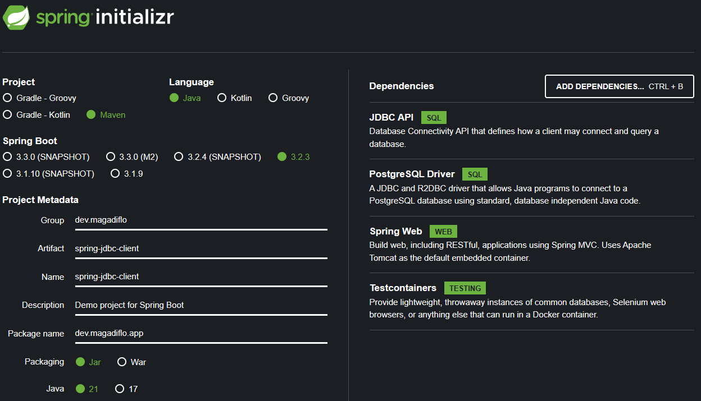

# [Spring JdbcClient Example](https://www.knowledgefactory.net/2023/12/spring-jdbcclient-example.html)

Este tutorial fue tomado de la página web **Knowledge Factory Dev**

Si queremos entender un poco más sobre `Testcontainers` podemos ir a los siguientes enlaces:

- Proyecto con Testcontainers [spring-boot-testcontainers](https://github.com/magadiflo/spring-boot-testcontainers.git)
- Proyecto con Testcontainers
  [spring-boot-testcontainers-jdbc](https://github.com/magadiflo/spring-boot-testcontainers-jdbc.git)

---

## Creación del proyecto

Utilizando Spring Initializr creamos el proyecto con las siguientes dependencias y configuraciones:



## Dependencias

````xml
<!--Spring Boot 3.2.3-->
<!--Java 21-->
<dependencies>
    <dependency>
        <groupId>org.springframework.boot</groupId>
        <artifactId>spring-boot-starter-jdbc</artifactId>
    </dependency>
    <dependency>
        <groupId>org.springframework.boot</groupId>
        <artifactId>spring-boot-starter-web</artifactId>
    </dependency>

    <dependency>
        <groupId>org.postgresql</groupId>
        <artifactId>postgresql</artifactId>
        <scope>runtime</scope>
    </dependency>
    <dependency>
        <groupId>org.springframework.boot</groupId>
        <artifactId>spring-boot-starter-test</artifactId>
        <scope>test</scope>
    </dependency>

    <!-- Al agregar el Testcontainers, en automático se agregan
     las siguientes 3 dependencias -->
    <dependency>
        <groupId>org.springframework.boot</groupId>
        <artifactId>spring-boot-testcontainers</artifactId>
        <scope>test</scope>
    </dependency>
    <dependency>
        <groupId>org.testcontainers</groupId>
        <artifactId>junit-jupiter</artifactId>
        <scope>test</scope>
    </dependency>
    <dependency>
        <groupId>org.testcontainers</groupId>
        <artifactId>postgresql</artifactId>
        <scope>test</scope>
    </dependency>
</dependencies>
````

## Configuración del application.yml

Para crear una tabla a través del `schema.sql`, debemos configurar `spring.sql.init.mode=always`.

Si está ejecutando la aplicación con una base de datos postgresql real, configure Spring Boot para usar PostgreSQL como
fuente de datos. Simplemente, estamos agregando la URL, el nombre de usuario y la contraseña de la base de
datos `PostgreSQL` en `src/main/resources/application.yml`.

````yaml
server:
  port: 8080
  error:
    include-message: always

spring:
  application:
    name: spring-jdbc-client

  datasource:
    url: jdbc:postgresql://localhost:5432/db_production
    username: postgres
    password: magadiflo

  sql:
    init:
      mode: always
````

## Creando el schema.sql y data.sql

Para generar un esquema de base de datos al inicio de la aplicación, el archivo `schema.sql` con los comandos SQL
correspondientes para la creación del esquema debe almacenarse en la carpeta de recursos.

````sql
CREATE TABLE IF NOT EXISTS students(
    id BIGSERIAL PRIMARY KEY,
    name VARCHAR(250) NOT NULL,
    email VARCHAR(250) NOT NULL,
    gender VARCHAR(250) NOT NULL,
    age INT
);
````

Cargue algunos datos de prueba iniciales.

````sql
TRUNCATE TABLE students RESTART IDENTITY;

INSERT INTO students (name, email, age, gender)
VALUES('Pro', 'pro@knf.com', 60, 'Male'),
('Alpha', 'alpha@knf.com', 50, 'Male'),
('Beta', 'beta@knf.com', 40, 'Female'),
('Gama', 'gama@knf.com', 30, 'Male'),
('Pekka', 'pekka@knf.com', 20, 'Female'),
('Noob', 'noob@knf.com', 10, 'Male'),
('Noob2', 'noob2@knf.com', 5, 'Male'),
('Noob3', 'noob3@knf.com', 5, 'Male');
````

## Model - Student

Crearemos nuestro modelo de estudiante usando un `record` de java:

````java
public record Student(
        Long id,
        String name,
        String email,
        String gender,
        Integer age) {
}
````

## Creando StudentDAO y StudentDAOImpl

````java
public interface StudentDAO {
    List<Student> findAllStudents();

    List<Student> findStudentByAgeAndGender(Integer age, String gender);

    List<Student> findStudentByGenderAndAgeGreaterThan(Integer age, String gender);

    Optional<Student> findStudentById(Long id);

    Integer insertStudent(Student student);

    Integer updateStudent(Student student);

    Integer deleteStudent(Long id);
}
````

`JdbcClient` **se configura automáticamente para nosotros en Spring Boot.**
En la clase siguiente vemos cómo `JdbcClient` es usado e inyectado en la clase de componente.

Notemos que con `JdbcClient` estamos conectando objetos entre sí utilizando el encadenamiento de métodos para lograr
legibilidad y usabilidad.

````java

@Repository
public class StudentDAOImpl implements StudentDAO {

    private final JdbcClient jdbcClient;

    public StudentDAOImpl(JdbcClient jdbcClient) {
        this.jdbcClient = jdbcClient;
    }

    @Override
    public List<Student> findAllStudents() {
        return this.jdbcClient.sql("""
                        SELECT s.id, s.name, s.email, s.gender, s.age
                        FROM students AS s
                        """)
                .query(Student.class) // Primera Forma, colocar directo la clase a la que queremos que se mapee
                .list();
    }

    @Override
    public List<Student> findStudentByAgeAndGender(Integer age, String gender) {
        return this.jdbcClient.sql("""
                        SELECT s.id, s.name, s.email, s.gender, s.age
                        FROM students AS s
                        WHERE s.age = :age AND s.gender = :gender
                        """)
                .param("age", age)
                .param("gender", gender)
                .query(new StudentRowMapper()) // Segunda Forma, seremos nosotros los que haremos el mapeo a través de la clase StudentRowMapper 
                .list();
    }

    @Override
    public List<Student> findStudentByGenderAndAgeGreaterThan(Integer age, String gender) {
        return this.jdbcClient.sql("""
                        SELECT s.id, s.name, s.email, s.gender, s.age
                        FROM students AS s
                        WHERE s.age > :age AND s.gender = :gender
                        """)
                .param("age", age)
                .param("gender", gender)
                .query(new StudentRowMapper())
                .list();
    }

    @Override
    public Optional<Student> findStudentById(Long id) {
        return this.jdbcClient.sql("""
                        SELECT s.id, s.name, s.email, s.gender, s.age
                        FROM students AS s
                        WHERE s.id = :id
                        """)
                .param("id", id)
                .query(Student.class)
                .optional();
    }

    @Override
    public Integer insertStudent(Student student) {
        return this.jdbcClient.sql("""
                        INSERT INTO students(name, email, gender, age)
                        VALUES(:name, :email, :gender, :age)
                        """)
                .param("name", student.name(), Types.VARCHAR)
                .param("email", student.email(), Types.VARCHAR)
                .param("gender", student.gender(), Types.VARCHAR)
                .param("age", student.age(), Types.INTEGER)
                .update();
    }

    @Override
    public Integer updateStudent(Student student) {
        return this.jdbcClient.sql("""
                        UPDATE students
                        SET name = :name, email = :email, gender = :gender, age = :age
                        WHERE id = :id
                        """)
                .param("name", student.name())
                .param("email", student.email())
                .param("gender", student.gender())
                .param("age", student.age())
                .param("id", student.id())
                .update();
    }

    @Override
    public Integer deleteStudent(Long id) {
        return this.jdbcClient.sql("DELETE FROM students WHERE id = :id")
                .param("id", id)
                .update();
    }

    static class StudentRowMapper implements RowMapper<Student> {
        @Override
        public Student mapRow(ResultSet rs, int rowNum) throws SQLException {
            return new Student(
                    rs.getLong("id"),
                    rs.getString("name"),
                    rs.getString("email"),
                    rs.getString("gender"),
                    rs.getInt("age"));
        }
    }
}
````

## Creando Servicio

````java
public interface StudentService {
    List<Student> findAllStudents();

    List<Student> findStudentByAgeAndGender(Integer age, String gender);

    List<Student> findStudentByGenderAndAgeGreaterThan(Integer age, String gender);

    Optional<Student> findStudentById(Long id);

    void insertStudent(Student student);

    void updateStudent(Student student, Long id);

    void deleteStudent(Long id);
}
````

````java

@Service
public class StudentServiceImpl implements StudentService {

    private static final Logger LOG = LoggerFactory.getLogger(StudentServiceImpl.class);
    private final StudentDAO studentDAO;

    public StudentServiceImpl(StudentDAO studentDAO) {
        this.studentDAO = studentDAO;
    }

    @Override
    @Transactional(readOnly = true)
    public List<Student> findAllStudents() {
        return this.studentDAO.findAllStudents();
    }

    @Override
    @Transactional(readOnly = true)
    public List<Student> findStudentByAgeAndGender(Integer age, String gender) {
        return this.studentDAO.findStudentByAgeAndGender(age, gender);
    }

    @Override
    @Transactional(readOnly = true)
    public List<Student> findStudentByGenderAndAgeGreaterThan(Integer age, String gender) {
        return this.studentDAO.findStudentByGenderAndAgeGreaterThan(age, gender);
    }

    @Override
    @Transactional(readOnly = true)
    public Optional<Student> findStudentById(Long id) {
        return this.studentDAO.findStudentById(id);
    }

    @Override
    @Transactional
    public void insertStudent(Student student) {
        Integer affectedRows = this.studentDAO.insertStudent(student);
        LOG.info("Affected rows after insert: {}", affectedRows);
    }

    @Override
    @Transactional
    public void updateStudent(Student student, Long id) {
        this.studentDAO.findStudentById(id)
                .map(studentDB -> {
                    Student studentToUpdate = new Student(id, student.name(), student.email(), student.gender(), student.age());
                    Integer affectedRows = this.studentDAO.updateStudent(studentToUpdate);
                    LOG.info("Affected rows after update: {}", affectedRows);
                    return affectedRows;
                }).orElseThrow(() -> new NoSuchElementException("No existe el id del estudiante a actualizar"));
    }

    @Override
    @Transactional
    public void deleteStudent(Long id) {
        this.studentDAO.findStudentById(id)
                .map(studentDB -> {
                    Integer affectedRows = this.studentDAO.deleteStudent(id);
                    LOG.info("Affected rows after deletion: {}", affectedRows);
                    return affectedRows;
                }).orElseThrow(() -> new NoSuchElementException("No existe el id del estudiante a eliminar"));
    }
}
````
