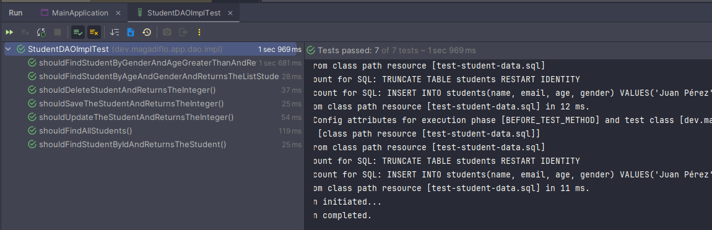

# [Spring JdbcClient Example](https://www.knowledgefactory.net/2023/12/spring-jdbcclient-example.html)

Este tutorial fue tomado de la página web **Knowledge Factory Dev**

Si queremos entender un poco más sobre `Testcontainers` podemos ir a los siguientes enlaces:

- Proyecto con Testcontainers [spring-boot-testcontainers](https://github.com/magadiflo/spring-boot-testcontainers.git)
- Proyecto con Testcontainers
  [spring-boot-testcontainers-jdbc](https://github.com/magadiflo/spring-boot-testcontainers-jdbc.git)

---

## Creación del proyecto

Utilizando Spring Initializr creamos el proyecto con las siguientes dependencias y configuraciones:


## Dependencias

````xml
<!--Spring Boot 3.2.3-->
<!--Java 21-->
<dependencies>
    <dependency>
        <groupId>org.springframework.boot</groupId>
        <artifactId>spring-boot-starter-jdbc</artifactId>
    </dependency>
    <dependency>
        <groupId>org.springframework.boot</groupId>
        <artifactId>spring-boot-starter-web</artifactId>
    </dependency>

    <dependency>
        <groupId>org.postgresql</groupId>
        <artifactId>postgresql</artifactId>
        <scope>runtime</scope>
    </dependency>
    <dependency>
        <groupId>org.springframework.boot</groupId>
        <artifactId>spring-boot-starter-test</artifactId>
        <scope>test</scope>
    </dependency>

    <!-- Al agregar el Testcontainers, en automático se agregan
     las siguientes 3 dependencias -->
    <dependency>
        <groupId>org.springframework.boot</groupId>
        <artifactId>spring-boot-testcontainers</artifactId>
        <scope>test</scope>
    </dependency>
    <dependency>
        <groupId>org.testcontainers</groupId>
        <artifactId>junit-jupiter</artifactId>
        <scope>test</scope>
    </dependency>
    <dependency>
        <groupId>org.testcontainers</groupId>
        <artifactId>postgresql</artifactId>
        <scope>test</scope>
    </dependency>
</dependencies>
````

## Configuración del application.yml

Para crear una tabla a través del `schema.sql`, debemos configurar `spring.sql.init.mode=always`.

Si está ejecutando la aplicación con una base de datos postgresql real, configure Spring Boot para usar PostgreSQL como
fuente de datos. Simplemente, estamos agregando la URL, el nombre de usuario y la contraseña de la base de
datos `PostgreSQL` en `src/main/resources/application.yml`.

````yaml
server:
  port: 8080
  error:
    include-message: always

spring:
  application:
    name: spring-jdbc-client

  datasource:
    url: jdbc:postgresql://localhost:5432/db_production
    username: postgres
    password: magadiflo

  sql:
    init:
      mode: always

logging:
  level:
    org.springframework.test.context.jdbc: DEBUG
    org.springframework.jdbc.datasource.init: DEBUG
````

Para ver qué `scripts SQL` se está ejecutando configuramos: `logging.level.org.springframework.test.context.jdbc=DEBUG`
y para ver qué `sentencias SQL` se están ejecutando `logging.level.org.springframework.jdbc.datasource.init=DEBUG`.

## Creando el schema.sql y data.sql

Para generar un esquema de base de datos al inicio de la aplicación, el archivo `schema.sql` con los comandos SQL
correspondientes para la creación del esquema debe almacenarse en la carpeta de recursos.

````sql
CREATE TABLE IF NOT EXISTS students(
    id BIGSERIAL PRIMARY KEY,
    name VARCHAR(250) NOT NULL,
    email VARCHAR(250) NOT NULL,
    gender VARCHAR(250) NOT NULL,
    age INT
);
````

Cargue algunos datos de prueba iniciales.

````sql
TRUNCATE TABLE students RESTART IDENTITY;

INSERT INTO students (name, email, age, gender)
VALUES('Pro', 'pro@knf.com', 60, 'Male'),
('Alpha', 'alpha@knf.com', 50, 'Male'),
('Beta', 'beta@knf.com', 40, 'Female'),
('Gama', 'gama@knf.com', 30, 'Male'),
('Pekka', 'pekka@knf.com', 20, 'Female'),
('Noob', 'noob@knf.com', 10, 'Male'),
('Noob2', 'noob2@knf.com', 5, 'Male'),
('Noob3', 'noob3@knf.com', 5, 'Male');
````

## Model - Student

Crearemos nuestro modelo de estudiante usando un `record` de java:

````java
public record Student(
        Long id,
        String name,
        String email,
        String gender,
        Integer age) {
}
````

## Creando StudentDAO y StudentDAOImpl

````java
public interface StudentDAO {
    List<Student> findAllStudents();

    List<Student> findStudentByAgeAndGender(Integer age, String gender);

    List<Student> findStudentByGenderAndAgeGreaterThan(Integer age, String gender);

    Optional<Student> findStudentById(Long id);

    Integer insertStudent(Student student);

    Integer updateStudent(Student student);

    Integer deleteStudent(Long id);
}
````

`JdbcClient` **se configura automáticamente para nosotros en Spring Boot.**
En la clase siguiente vemos cómo `JdbcClient` es usado e inyectado en la clase de componente.

Notemos que con `JdbcClient` estamos conectando objetos entre sí utilizando el encadenamiento de métodos para lograr
legibilidad y usabilidad.

````java

@Repository
public class StudentDAOImpl implements StudentDAO {

    private final JdbcClient jdbcClient;

    public StudentDAOImpl(JdbcClient jdbcClient) {
        this.jdbcClient = jdbcClient;
    }

    @Override
    public List<Student> findAllStudents() {
        return this.jdbcClient.sql("""
                        SELECT s.id, s.name, s.email, s.gender, s.age
                        FROM students AS s
                        """)
                .query(Student.class) // Primera Forma, colocar directo la clase a la que queremos que se mapee
                .list();
    }

    @Override
    public List<Student> findStudentByAgeAndGender(Integer age, String gender) {
        return this.jdbcClient.sql("""
                        SELECT s.id, s.name, s.email, s.gender, s.age
                        FROM students AS s
                        WHERE s.age = :age AND s.gender = :gender
                        """)
                .param("age", age)
                .param("gender", gender)
                .query(new StudentRowMapper()) // Segunda Forma, seremos nosotros los que haremos el mapeo a través de la clase StudentRowMapper 
                .list();
    }

    @Override
    public List<Student> findStudentByGenderAndAgeGreaterThan(Integer age, String gender) {
        return this.jdbcClient.sql("""
                        SELECT s.id, s.name, s.email, s.gender, s.age
                        FROM students AS s
                        WHERE s.age > :age AND s.gender = :gender
                        """)
                .param("age", age)
                .param("gender", gender)
                .query(new StudentRowMapper())
                .list();
    }

    @Override
    public Optional<Student> findStudentById(Long id) {
        return this.jdbcClient.sql("""
                        SELECT s.id, s.name, s.email, s.gender, s.age
                        FROM students AS s
                        WHERE s.id = :id
                        """)
                .param("id", id)
                .query(Student.class)
                .optional();
    }

    @Override
    public Integer insertStudent(Student student) {
        return this.jdbcClient.sql("""
                        INSERT INTO students(name, email, gender, age)
                        VALUES(:name, :email, :gender, :age)
                        """)
                .param("name", student.name(), Types.VARCHAR)
                .param("email", student.email(), Types.VARCHAR)
                .param("gender", student.gender(), Types.VARCHAR)
                .param("age", student.age(), Types.INTEGER)
                .update();
    }

    @Override
    public Integer updateStudent(Student student) {
        return this.jdbcClient.sql("""
                        UPDATE students
                        SET name = :name, email = :email, gender = :gender, age = :age
                        WHERE id = :id
                        """)
                .param("name", student.name())
                .param("email", student.email())
                .param("gender", student.gender())
                .param("age", student.age())
                .param("id", student.id())
                .update();
    }

    @Override
    public Integer deleteStudent(Long id) {
        return this.jdbcClient.sql("DELETE FROM students WHERE id = :id")
                .param("id", id)
                .update();
    }

    static class StudentRowMapper implements RowMapper<Student> {
        @Override
        public Student mapRow(ResultSet rs, int rowNum) throws SQLException {
            return new Student(
                    rs.getLong("id"),
                    rs.getString("name"),
                    rs.getString("email"),
                    rs.getString("gender"),
                    rs.getInt("age"));
        }
    }
}
````

## Creando Servicio

````java
public interface StudentService {
    List<Student> findAllStudents();

    List<Student> findStudentByAgeAndGender(Integer age, String gender);

    List<Student> findStudentByGenderAndAgeGreaterThan(Integer age, String gender);

    Optional<Student> findStudentById(Long id);

    void insertStudent(Student student);

    void updateStudent(Student student, Long id);

    void deleteStudent(Long id);
}
````

````java

@Service
public class StudentServiceImpl implements StudentService {

    private static final Logger LOG = LoggerFactory.getLogger(StudentServiceImpl.class);
    private final StudentDAO studentDAO;

    public StudentServiceImpl(StudentDAO studentDAO) {
        this.studentDAO = studentDAO;
    }

    @Override
    @Transactional(readOnly = true)
    public List<Student> findAllStudents() {
        return this.studentDAO.findAllStudents();
    }

    @Override
    @Transactional(readOnly = true)
    public List<Student> findStudentByAgeAndGender(Integer age, String gender) {
        return this.studentDAO.findStudentByAgeAndGender(age, gender);
    }

    @Override
    @Transactional(readOnly = true)
    public List<Student> findStudentByGenderAndAgeGreaterThan(Integer age, String gender) {
        return this.studentDAO.findStudentByGenderAndAgeGreaterThan(age, gender);
    }

    @Override
    @Transactional(readOnly = true)
    public Optional<Student> findStudentById(Long id) {
        return this.studentDAO.findStudentById(id);
    }

    @Override
    @Transactional
    public void insertStudent(Student student) {
        Integer affectedRows = this.studentDAO.insertStudent(student);
        LOG.info("Affected rows after insert: {}", affectedRows);
    }

    @Override
    @Transactional
    public void updateStudent(Student student, Long id) {
        this.studentDAO.findStudentById(id)
                .map(studentDB -> {
                    Student studentToUpdate = new Student(id, student.name(), student.email(), student.gender(), student.age());
                    Integer affectedRows = this.studentDAO.updateStudent(studentToUpdate);
                    LOG.info("Affected rows after update: {}", affectedRows);
                    return affectedRows;
                }).orElseThrow(() -> new NoSuchElementException("No existe el id del estudiante a actualizar"));
    }

    @Override
    @Transactional
    public void deleteStudent(Long id) {
        this.studentDAO.findStudentById(id)
                .map(studentDB -> {
                    Integer affectedRows = this.studentDAO.deleteStudent(id);
                    LOG.info("Affected rows after deletion: {}", affectedRows);
                    return affectedRows;
                }).orElseThrow(() -> new NoSuchElementException("No existe el id del estudiante a eliminar"));
    }
}
````

## Creando controlador

````java

@RestController
@RequestMapping(path = "/api/v1/students")
public class StudentController {

    private final StudentService studentService;

    public StudentController(StudentService studentService) {
        this.studentService = studentService;
    }

    @GetMapping
    public ResponseEntity<List<Student>> getAllStudents() {
        return ResponseEntity.ok(this.studentService.findAllStudents());
    }

    @GetMapping(path = "/with-age-and-gender")
    public ResponseEntity<List<Student>> getStudentsByAgeAndGender(@RequestParam Integer age, @RequestParam String gender) {
        return ResponseEntity.ok(this.studentService.findStudentByAgeAndGender(age, gender));
    }

    @GetMapping(path = "/with-gender-and-age-greater-than")
    public ResponseEntity<List<Student>> getStudentsByGenderAndAgeGreaterThan(@RequestParam Integer age, @RequestParam String gender) {
        return ResponseEntity.ok(this.studentService.findStudentByGenderAndAgeGreaterThan(age, gender));
    }

    @GetMapping(path = "/{id}")
    public ResponseEntity<Student> getStudentById(@PathVariable Long id) {
        return this.studentService.findStudentById(id)
                .map(ResponseEntity::ok)
                .orElseGet(() -> ResponseEntity.notFound().build());
    }

    @PostMapping
    public ResponseEntity<Void> saveStudent(@RequestBody Student student) {
        this.studentService.insertStudent(student);
        return ResponseEntity.status(HttpStatus.CREATED).build();
    }

    @PutMapping(path = "/{id}")
    public ResponseEntity<Void> updateStudent(@RequestBody Student student, @PathVariable Long id) {
        this.studentService.updateStudent(student, id);
        return ResponseEntity.ok().build();
    }

    @DeleteMapping(path = "/{id}")
    public ResponseEntity<Void> deleteStudent(@PathVariable Long id) {
        this.studentService.deleteStudent(id);
        return ResponseEntity.noContent().build();
    }
}
````

## Probando endpoints

````bash
$  curl -v http://localhost:8080/api/v1/students | jq

>
< HTTP/1.1 200
<
[
  {
    "id": 1,
    "name": "Pro",
    "email": "pro@knf.com",
    "gender": "Male",
    "age": 60
  },
  {...},
  {...},
  {...},
  {...}
]
````

````bash
$ curl -v -G --data "age=5&gender=Male" http://localhost:8080/api/v1/students/with-age-and-gender | jq

>
< HTTP/1.1 200
<
[
  {
    "id": 7,
    "name": "Noob2",
    "email": "noob2@knf.com",
    "gender": "Male",
    "age": 5
  },
  {
    "id": 8,
    "name": "Noob3",
    "email": "noob3@knf.com",
    "gender": "Male",
    "age": 5
  }
]
````

````bash
$ curl -v -X POST -H "Content-Type: application/json" -d "{\"name\": \"Martin\", \"email\": \"martin@gmail.com\", \"gender\": \"Male\", \"age\": 35}" http://localhost:8080/api/v1/students | jq

< HTTP/1.1 201
<
````

````bash
$ curl -v -X PUT -H "Content-Type: application/json" -d "{\"name\": \"Gaspar\", \"email\": \"gaspar@gmail.com\", \"gender\": \"Masculino\", \"age\": 30}" http://localhost:8080/api/v1/students/9 | jq

>
< HTTP/1.1 200
<
````

````bash
$ curl -v -X DELETE http://localhost:8080/api/v1/students/5| jq
>
< HTTP/1.1 204
````

---

# Implementando Tests

---

Para ejecutar el test, debemos tener instalado `Docker` en nuestra máquina local.

## Script test-student-data.sql

Antes de empezar a crear la clase de `test` para nuestro `StudentDAOImpl` vamos a crear en el directorio de test
`src/test/resources/test-student-data.sql` el script que usaremos para realizar nuestras pruebas:

````sql
TRUNCATE TABLE students RESTART IDENTITY;

INSERT INTO students(name, email, age, gender)
VALUES('Juan Pérez', 'juan@gmail.com', 30, 'Masculino'),
('María García', 'maria@gmail.com', 25, 'Femenino'),
('Carlos López', 'carlos@gmail.com', 32, 'Masculino'),
('Laura Martínez', 'laura@gmail.com', 28, 'Femenino'),
('Pedro Rodríguez', 'pedro@gmail.com', 32, 'Masculino'),
('Ana Gómez', 'ana@gmail.com', 29, 'Femenino'),
('Luis Fernández', 'luis@gmail.com', 31, 'Masculino'),
('Elena Sánchez', 'elena@gmail.com', 27, 'Femenino'),
('Miguel González', 'miguel@gmail.com', 32, 'Masculino'),
('Sofía Díaz', 'sofia@gmail.com', 26, 'Femenino'),
('Carla Díaz', 'carla.diaz@gmail.com', 35, 'Femenino'),
('Melissa Díaz', 'melissa.diaz@gmail.com', 28, 'Femenino'),
('María Díaz', 'maria.diaz@gmail.com', 29, 'Femenino'),
('Milagros Díaz', 'milagros.diaz@gmail.com', 32, 'Femenino');
````

**NOTA**

El script `test-student-data.sql` solo lo usamos para las pruebas, mientras que el `data.sql` lo estamos usando para
ejecutar la aplicación real, es decir, como si fueran datos en producción.

## Creando StudentDAOImplTest

La anotación `@JdbcTest` es una anotación para una prueba `JDBC` que se centra únicamente en componentes basados
en `JDBC`. **El uso de esta anotación deshabilitará la configuración automática completa y, en su lugar, aplicará solo
la configuración relevante para las pruebas JDBC.**

De forma predeterminada, las pruebas anotadas con `@JdbcTest` **son transaccionales y se revierten al final de cada
prueba.** También utilizan una base de datos integrada en memoria **(que reemplaza cualquier fuente de datos explícita
o generalmente configurada automáticamente).** La anotación `@AutoConfigureTestDatabase` se puede utilizar para anular
estas configuraciones.

`@Testcontainers` es una extensión de `JUnit Jupiter` para activar el inicio y la parada automáticos de los contenedores
utilizados en un caso de prueba.
La extensión `@Testcontainers` encuentra todos los campos anotados con `@Container` y llama a sus métodos de ciclo de
vida de contenedor. Los contenedores declarados como campos estáticos se compartirán entre los métodos de prueba. Se
iniciarán solo una vez antes de ejecutar cualquier método de prueba y se detendrán después de que se haya ejecutado el
último método de prueba. Los contenedores declarados como campos de instancia se iniciarán y detendrán para cada método
de prueba.

`@Sql` se utiliza para anotar una clase de prueba o un método de prueba para configurar scripts y declaraciones SQL que
se ejecutarán en una base de datos determinada durante las pruebas de integración.

````java
import static org.assertj.core.api.AssertionsForClassTypes.assertThat;

@Testcontainers
@Sql(scripts = {"/test-student-data.sql"})
@JdbcTest
@AutoConfigureTestDatabase(replace = AutoConfigureTestDatabase.Replace.NONE)
class StudentDAOImplTest {

    private static final Logger LOG = LoggerFactory.getLogger(StudentServiceImpl.class);

    @Container
    @ServiceConnection
    private static final PostgreSQLContainer<?> POSTGRES_CONTAINER = new PostgreSQLContainer<>("postgres:15.2-alpine");

    @Autowired
    private JdbcClient jdbcClient;
    private StudentDAOImpl studentDAO;

    @BeforeEach
    void setUp() {
        this.studentDAO = new StudentDAOImpl(this.jdbcClient);
    }

    @Test
    void shouldSaveTheStudentAndReturnsTheInteger() {
        // Given
        Student student = new Student(null, "Martín", "martin@gmail.com", "Masculino", 35);

        // When
        Integer affectedRows = this.studentDAO.insertStudent(student);

        // Then
        assertThat(affectedRows).isEqualTo(1);
    }

    @Test
    void shouldUpdateTheStudentAndReturnsTheInteger() {
        // Given
        Long studentId = 1L;
        Student student = new Student(studentId, "Martín", "martin@gmail.com", "Masculino", 35);

        Optional<Student> optionalStudentBeforeUpdating = this.studentDAO.findStudentById(studentId);
        Student studentBefore = optionalStudentBeforeUpdating.get();

        assertThat(studentBefore).isNotNull();
        LOG.info("beforeUpdating: {}", studentBefore);

        // When
        Integer affectedRows = this.studentDAO.updateStudent(student);

        // Then
        assertThat(affectedRows).isEqualTo(1);

        Optional<Student> optionalStudentAfterUpdating = this.studentDAO.findStudentById(studentId);
        Student studentAfter = optionalStudentAfterUpdating.get();

        assertThat(studentAfter).isNotNull();
        assertThat(studentAfter.name()).isEqualTo(student.name());
        assertThat(studentAfter.email()).isEqualTo(student.email());
        assertThat(studentAfter.gender()).isEqualTo(student.gender());
        assertThat(studentAfter.age()).isEqualTo(student.age());
        LOG.info("afterUpdating: {}", studentAfter);
    }

    @Test
    void shouldDeleteStudentAndReturnsTheInteger() {
        // Given
        Long studentId = 1L;

        // When
        Integer affectedRows = this.studentDAO.deleteStudent(studentId);

        // Then
        assertThat(affectedRows).isEqualTo(1);
        Optional<Student> optionalStudent = this.studentDAO.findStudentById(studentId);
        assertThat(optionalStudent.isEmpty()).isTrue();
    }

    @Test
    void shouldFindStudentByIdAndReturnsTheStudent() {
        // Given
        Long studentId = 1L;

        // When
        Student studentDB = this.studentDAO.findStudentById(studentId).get();

        // Then
        assertThat(studentDB).isNotNull();
        assertThat(studentDB.id()).isEqualTo(studentId);
        assertThat(studentDB.name()).isEqualTo("Juan Pérez");
        assertThat(studentDB.email()).isEqualTo("juan@gmail.com");
        assertThat(studentDB.age()).isEqualTo(30);
        assertThat(studentDB.gender()).isEqualTo("Masculino");
    }

    @Test
    void shouldFindAllStudents() {
        // Given

        // When
        List<Student> students = this.studentDAO.findAllStudents();

        // Then
        assertThat(students.size()).isEqualTo(14);
    }

    @Test
    void shouldFindStudentByAgeAndGenderAndReturnsTheListStudents() {
        // Given

        // When
        List<Student> students = this.studentDAO.findStudentByAgeAndGender(32, "Masculino");

        // Then
        List<Long> ids = students.stream()
                .map(Student::id)
                .toList();

        assertThat(ids.size()).isEqualTo(3);
        assertThat(ids).isEqualTo(List.of(3L, 5L, 9L));

        assertThat(students.getFirst().id()).isEqualTo(3);
        assertThat(students.getFirst().name()).isEqualTo("Carlos López");
        assertThat(students.getFirst().email()).isEqualTo("carlos@gmail.com");
        assertThat(students.getFirst().age()).isEqualTo(32);
        assertThat(students.getFirst().gender()).isEqualTo("Masculino");
    }

    @Test
    void shouldFindStudentByGenderAndAgeGreaterThanAndReturnsTheListStudents() {
        // Given

        // When
        List<Student> students = this.studentDAO.findStudentByGenderAndAgeGreaterThan(30, "Femenino");

        // Then
        List<Long> ids = students.stream()
                .map(Student::id)
                .toList();

        assertThat(ids.size()).isEqualTo(2);
        assertThat(ids).isEqualTo(List.of(11L, 14L));
    }
}
````

## Ejecutando Tests

Dado que utilizamos `Testcontainers`, asegúrese de iniciar `Docker` en su máquina local. Después de eso, ejecute la
prueba.


